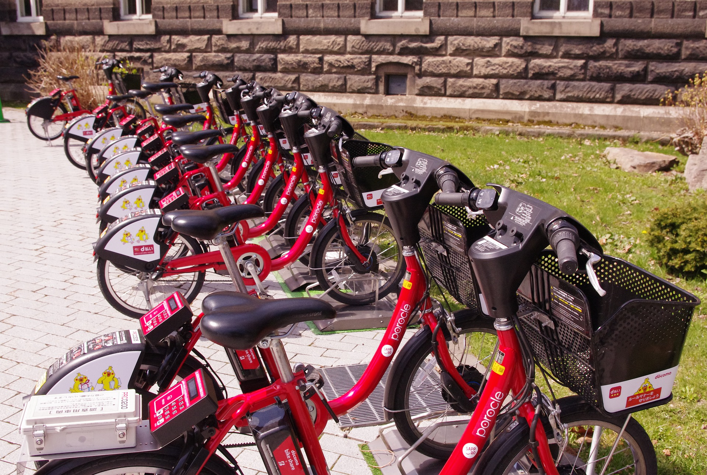

# Predicting Bike-Sharing Patterns using Neural Networks

This is one of the projects I've built in Udacity **Deep Learning Nanodegree**.

A lot of this readme is taken exactly from the project description made by Udacity and I have just made small modifications to their description and put it in this readme.

## Introduction

In this project, I've built a neural network to carry out a prediction problem on a real dataset! 

The data comes from the [UCI Machine Learning Database](https://archive.ics.uci.edu/ml/datasets/Bike+Sharing+Dataset).

## Instructions to run this project

1. Download the project materials from this repository.
2. cd into the project directory.
3. Download anaconda or miniconda.
4. Create a new conda environment: `conda create --name deep-learning python=3`
5. Enter your new environment:
    * Mac/Linux: `>> source activate deep-learning`
    * Windows: `>> activate deep-learning`
6. Ensure you have `numpy`, `matplotlib`, `pandas`, and `jupyter notebook` installed by doing the following:
`conda install numpy matplotlib pandas jupyter notebook`
7. Run the following to open up the notebook server:
`jupyter notebook`
8. Follow the instructions in the notebook; they will lead you through the project. I've only edited the my_answers.py python file, whose components are imported into the notebook
at various places.
